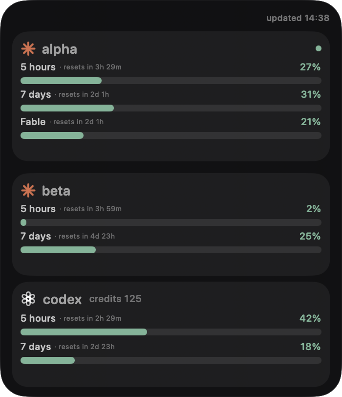

# Quota Orbits

A lightweight macOS desktop widget for tracking Claude and Codex usage limits.

| Orbits | Bars |
| --- | --- |
|  |  |

## What it shows

- Claude 5-hour, 7-day, and scoped limits for every account available through `cswap`
- Codex 5-hour and 7-day limits, plus the credits balance when available
- Live reset countdowns, automatic refresh, and stale-data indicators

## Requirements

- macOS 14 or newer
- Swift 6 toolchain
- [`cswap`](https://github.com/realiti4/claude-swap) with your Claude accounts configured
- Codex CLI with an authenticated session

## Install

```bash
git clone https://github.com/darkweid/coding-agent-limits.git
cd coding-agent-limits
./scripts/install-app.sh
```

The app is installed to `~/Applications/Quota Orbits.app` and opens automatically.

## Use

Right-click the widget to refresh it, move or pin it, open Settings, or quit. Settings let you choose the refresh interval, used or remaining percentages, and the Bars or Orbits layout. Scroll the account list when more accounts are available.

To open the widget again:

```bash
open "$HOME/Applications/Quota Orbits.app"
```

Quota Orbits reads usage data locally from your existing `cswap` and Codex CLI sessions.
