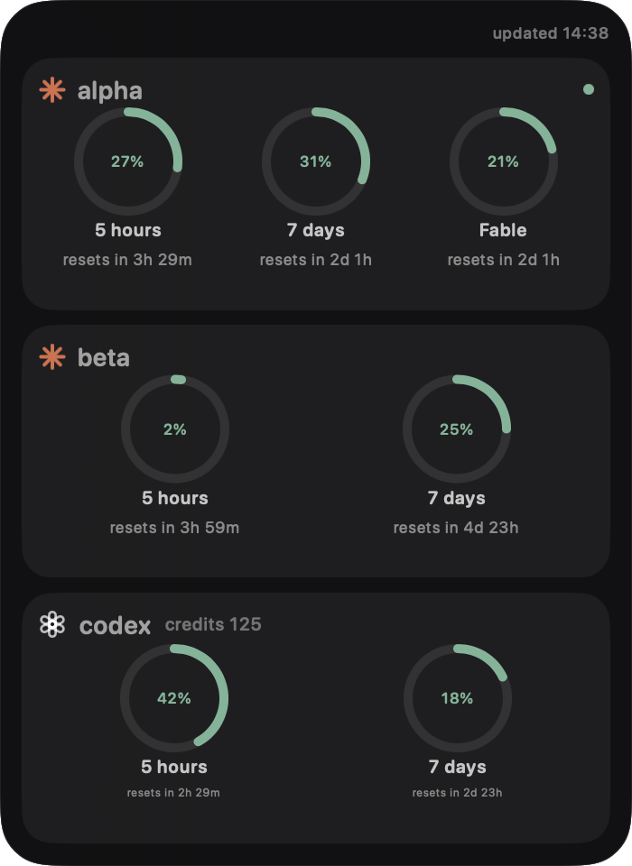
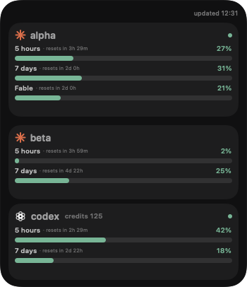
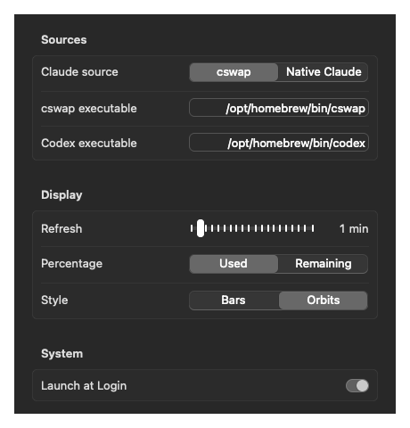

# Coding Agent Limits

A lightweight macOS desktop widget for tracking Claude and Codex usage limits.

| Orbits | Bars |
| --- | --- |
|  |  |

## Settings



## What it shows

- Claude 5-hour, 7-day, and scoped limits from either native Claude Code or every account available through `cswap`
- Codex 5-hour and 7-day limits, plus the credits balance when available
- Live reset countdowns, automatic refresh, and stale-data indicators

## Requirements

- macOS 14 or newer
- Swift 6 toolchain
- Claude Code with an authenticated session, or [`cswap`](https://github.com/realiti4/claude-swap) for multiple Claude accounts
- Codex CLI with an authenticated session

## Install

```bash
git clone https://github.com/darkweid/coding-agent-limits.git
cd coding-agent-limits
./scripts/install-app.sh
```

The app is installed to `~/Applications/Coding Agent Limits.app` and opens automatically.

## Use

Right-click the widget to refresh it, move or pin it, open Settings, or quit. Settings let you choose native Claude Code or `cswap`, the refresh interval, used or remaining percentages, and the Bars or Orbits layout. Scroll the account list when more accounts are available.

To open the widget again:

```bash
open "$HOME/Applications/Coding Agent Limits.app"
```

To add a desktop shortcut:

```bash
ln -s "$HOME/Applications/Coding Agent Limits.app" "$HOME/Desktop/Coding Agent Limits.app"
```

Coding Agent Limits reads usage data locally from your existing Claude Code or `cswap` and Codex CLI sessions.

## License

[MIT](LICENSE)
